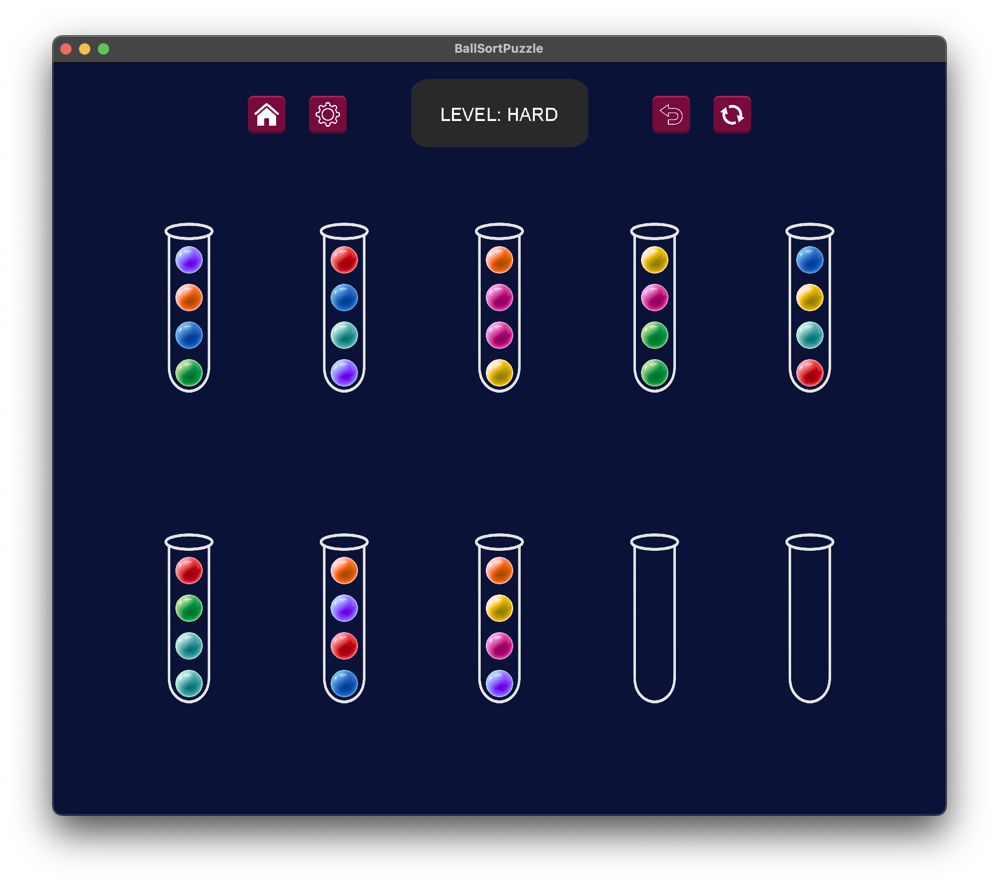

# 🧩 Ball Sort Puzzle

Ball Sort Puzzle is a classic logic puzzle game where the goal is to sort colored balls into separate tubes so that each tube contains balls of only one color. The game focuses on planning and problem-solving through simple interactions and increasingly challenging levels.

---

## 🎮 How to Play
- Tap/click a tube to pick the top ball.
- Tap/click another tube to place the ball.
- You can only place a ball:
    - into an empty tube, or
    - on top of a ball with the same color.
- Use **Undo** to revert the last move.
- Use **Restart** to reset the current level.
- You win when all tubes are correctly sorted.

---

## 🛠️ Tech Stack
- Java
- LibGDX + LWJGL 3 (Desktop)

---

## 🚀 How to Run (Desktop)

> Important: The game uses a texture atlas. You must generate/update the atlas before running the desktop launcher.

1. Clone the repository:
   ```bash
   git clone https://github.com/your-username/ball-sort-puzzle.git
   ```
2. Open the project in your IDE.
3. Generate the texture atlas:
    - Go to:
    ```swift
    lwjgl3/src/main/java/si/um/feri/BallSortPuzzle/lwjgl3
    ```
    - Run: **AssetPacker** (this creates/updates the texture atlas from the raw assets).
4. Run the game:
    - In the same package, run: **Lwjgl3Launcher**

--- 

## 📱 Screenshots



---

## 👤 Author
- **Lejla Gutic**
- GitHub: [lejla-gutic](https://github.com/lejla-gutic)

---

## 📄 License
This project is licensed under the MIT License.
